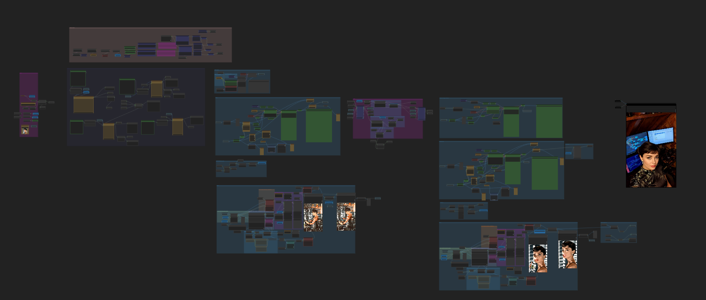
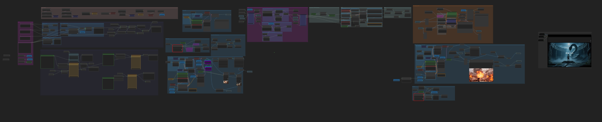

# ComfyUI Workflow: Sora2-Alike Full Loop Video

Open-source video generation pipeline in ComfyUI that creates coherent multi-shot video narratives with synchronized dialogue — inspired by OpenAI's Sora 2.

Generate complete video stories from minimal input: a character description, a reference photo, and the number of scenes. The workflow orchestrates multiple AI models through a 4-LLM pipeline to handle dialogue writing, cinematography, voice casting, and animation automatically.

---

## 🎬 Workflows Included

This repository contains two powerful workflows:

### 1. **Main Workflow: Sora2-ComfyUI** (Character-Based Video Generation)
**File**: `workflow-full-loop-Sora2-ComfyUI.json`




Character-driven multi-shot video generation with automated dialogue and perfect lip-sync.

### 2. **Story Creator** (Narrative Sequences with Music)
**File**: `workflow-full-loop-Storycreator.json`




Text-to-story generation with custom styles, music synchronization, and complete narrative control.

---

## ✨ Key Features

- **4-LLM Pre-Production Pipeline**: Scriptwriter → Cinematographer → Animation Director → Voice Casting
- **Scene Consistency**: Last-frame continuation ensures visual coherence between shots
- **AI Cinematography**: Custom-trained `Next Scene` LoRA interprets "Next shot..." prompts to change camera angles intelligently
- **Perfect Lip-Sync**: Dynamic audio-video synchronization using custom `Audio Duration` node
- **Automated Face Swapping**: Maintains character identity across all generated scenes
- **One-Click Generation**: Complete multi-shot videos from simple inputs

---

## 🛠️ Installation

### Recommended Configuration

- **GPU**: Minimum RTX 6000 Pro (96GB VRAM) to run the full workflow
- **Alternative**: Use [RunPod](https://www.runpod.io/) or similar cloud GPU services
- Plenty of online guides available for RunPod ComfyUI setup

### Download Workflow & Custom Nodes

1. **Clone or download this repository**:
   ```bash
   git clone https://github.com/lovis93/ComfyUI-Workflow-Sora2Alike-Full-loop-video.git
   ```

2. **Install ComfyUI-Lovis-Node** (required custom nodes):
   ```bash
   # Copy to your ComfyUI custom_nodes directory
   cp -r ComfyUI-Lovis-Node /path/to/ComfyUI/custom_nodes/
   
   # Install dependencies
   cd /path/to/ComfyUI/custom_nodes/ComfyUI-Lovis-Node
   pip install -r requirements.txt
   ```

3. **Install other required custom nodes** via ComfyUI Manager:
   - ComfyUI-WanVideoWrapper
   - ComfyUI-Custom-Scripts (pythongosssss)
   - ComfyUI LayerStyle
   - ComfyUI Easy Use
   - ComfyUI essentials (mb fork)
   - Audio Batch
   - ComfyUI Workflow Encrypt
   - ComfyUI JM MiniMax API
   - Infinite Talk nodes

4. **Load the workflow**:
   - Open ComfyUI
   - Load `workflow-full-loop-Sora2-ComfyUI.json` (main character-based workflow)

### Download Models

**Base Models** (place in `ComfyUI/models/`):

- `qwen_image_distill_full_fp8_e4m3fn.safetensors` — Qwen-Image (text-to-image)
- `qwen_image_edit_2509_fp8_e4m3fn.safetensors` — Qwen-Image-Edit (scene transitions)
- `wan2.2_i2v_high_noise_14B_fp16.safetensors` — Wan 2.2 I2V (video generation)
- `wan2.2_i2v_low_noise_14B_fp16.safetensors` — Wan 2.2 I2V low noise
- `Wan2_1-InfiniTetalk-Single_fp16.safetensors` — Infinite Talk (talking heads)
- `wan_2.1_vae.safetensors` — Wan VAE
- `qwen_image_vae.safetensors` — Qwen VAE
- `qwen_2.5_vl_7b_fp8_scaled.safetensors` — Text encoder
- `umt5_xxl_fp16.safetensors` — UMT5
- `clip_vision_h.safetensors` — CLIP Vision

**LoRAs** (place in `ComfyUI/models/loras/`):

- `next-scene_lora_v1-3000.safetensors` — **Next Scene LoRA** (AI Cinematographer)
  - Download: [lovis93/next-scene-qwen-image-lora-2509](https://huggingface.co/lovis93/next-scene-qwen-image-lora-2509)

- `motionpushin-v5-wan-i2v-14b-720p-400.safetensors` — **Motion Push-In LoRA** (Camera motion)
  - Download: [lovis93/Motion-Lora-Camera-Push-In-Wan-14B-720p-I2V](https://huggingface.co/lovis93/Motion-Lora-Camera-Push-In-Wan-14B-720p-I2V)

- `Wan21_I2V_14B_lightx2v_cfg_step_distill_lora_rank64.safetensors` — Wan distill LoRA
- `Qwen-Image-Lightning-4steps-V1.0.safetensors` — Qwen Lightning LoRA
- `Qwen_influencer_style_v1.safetensors` — Style LoRA

---

## 🚀 Usage

### Workflow 1: Sora2-ComfyUI (Main Character Workflow)

**Inputs**:

1. **Main Prompt**: Character description (e.g., "Audrey loves ComfyUI, she is a geek")
2. **Reference Photo**: Clear photo of your character
3. **Number of Lines**: How many dialogue lines/scenes to generate (e.g., 4)

### Configuration

- **Image Size**: 768x512 (faster) or higher for quality
- **FPS**: 24 or 30

### Run

Click **Queue Prompt** and wait. The workflow will automatically:
1. Generate dialogue and cinematography via 4 LLMs
2. Create initial scene with face swap
3. Loop through remaining scenes with consistent transitions
4. Synthesize audio with perfect duration matching
5. Animate each scene with lip-sync
6. Combine all segments into final video

---

## 🎬 How It Works

### Core Architecture

**Models**:
- `Qwen-Image` — Initial image generation for scene 1
- `Qwen-Image-Edit` — Scene transitions via image editing (scenes 2+)
- `Wan 2.2 I2V` + `Infinite Talk` — Video animation with talking heads
- Custom LoRAs: `Next Scene` (cinematography) + `Motion Pushin` (camera motion)

**Custom Nodes** (included in ComfyUI-Lovis-Node):
- Line Count Node — Counts dialogue lines
- Text to Single Line Node — Text formatting
- Audio Duration Node — Calculates exact audio duration for perfect sync

### 4-LLM Pre-Processing Pipeline

Before video generation, 4 specialized LLMs process your input:

1. **LLM 1 - Scriptwriter**: Generates N dialogue lines from character prompt
2. **LLM 2 - Cinematographer**: Creates N image prompts (scenes 2+ prefixed with "Next shot...")
3. **LLM 3 - Animation Director**: Creates N video animation prompts
4. **LLM 4 - Voice Casting**: Generates detailed voice profile (via MiniMax)

### Execution Pipeline

**Phase 1 — Scene 1 Initialization**:
1. Generate initial frame with `Qwen-Image`
2. Automated face swap (reference photo → generated image)
3. Synthesize audio for dialogue line 1
4. Measure exact audio duration (`Audio Duration` node)
5. Animate with `Wan 2.2 I2V` + `Infinite Talk` (duration = audio length)

**Phase 2 — Iterative Loop (Scenes 2-N)**:
1. Take **last frame** of previous video clip
2. Edit frame with `Qwen-Image-Edit` + `Next Scene` LoRA + "Next shot..." prompt
3. Result: new camera angle while preserving character/environment
4. Automated face swap on new frame
5. Generate audio → measure duration → animate
6. Repeat until all lines complete

**Phase 3 — Final Assembly**:
- Concatenate all video segments + audio clips
- Output single continuous video

### Key Innovation

- **Last-frame continuation**: Each scene starts from the previous scene's final frame
- **"Next shot..." trigger**: Activates `Next Scene` LoRA for intelligent camera angle changes
- **Dynamic synchronization**: Video length automatically matches audio duration (no manual timing)

---

## 📋 Included Custom Nodes

### ComfyUI-Lovis-Node

**Line Count Node** (`text/utility`):
- Counts lines in text input
- Determines number of scenes to generate

**Text to Single Line Node** (`text/utility`):
- Converts multi-line text to single line with customizable separators

**Audio Duration Node** (`audio/utility`):
- Extracts duration from audio data in seconds
- Calculates frame count based on FPS
- Critical for perfect lip-sync synchronization

See `ComfyUI-Lovis-Node/README.md` for detailed documentation.

---

### Workflow 2: Story Creator

Alternative workflow for creating narrative sequences with more creative control.

**Features**:
- **Text-to-Story**: Automatically generates visual sequences from any story text
- **Custom Styles**: Apply different visual styles and looks to your narrative
- **Music Synchronization**: Generates music automatically timed to the story
- **Same Core Tools**: Built on the same model foundation as the main workflow

**Use Case**: Ideal for creating complete stories, film sequences, or narrative content with custom aesthetics and synchronized soundtracks.

---

## 🙏 Credits

**Models & Technologies**:
- Qwen-Image / Qwen-Image-Edit — Alibaba Cloud
- Wan 2.2 I2V — Wan AI
- Infinite Talk — Infinite Talk Project
- MiniMax Voice Synthesis — MiniMax AI

**Custom LoRAs**:
- Next Scene LoRA — Trained by [@lovis93](https://huggingface.co/lovis93) on 100+ cinematic transitions
- Motion Push-In LoRA — Trained by [@lovis93](https://huggingface.co/lovis93) on 100+ drone camera clips

**Inspiration**:
- OpenAI Sora 2 — For demonstrating AI video generation potential

---

## 📜 License

MIT License — Free to use, modify, and share.

Custom LoRAs: Apache 2.0 License (see model cards on HuggingFace).

---

## 📞 Contact

- **GitHub**: [lovis93](https://github.com/lovis93)
- **X**: [lovis93](https://x.com/OdinLovis)
- **HuggingFace**: [@lovis93](https://huggingface.co/lovis93)
- **Issues**: [Report bugs or request features](https://github.com/lovis93/ComfyUI-Workflow-Sora2Alike-Full-loop-video/issues)

---

**Built with ❤️ for the open-source AI community**

*Making cinematic AI video generation accessible to everyone.*
